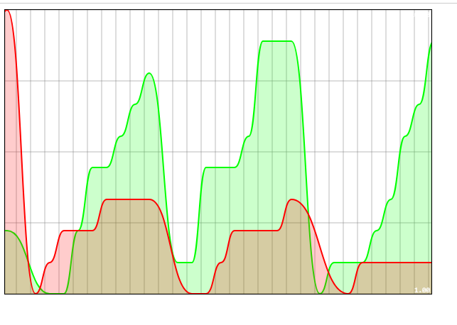
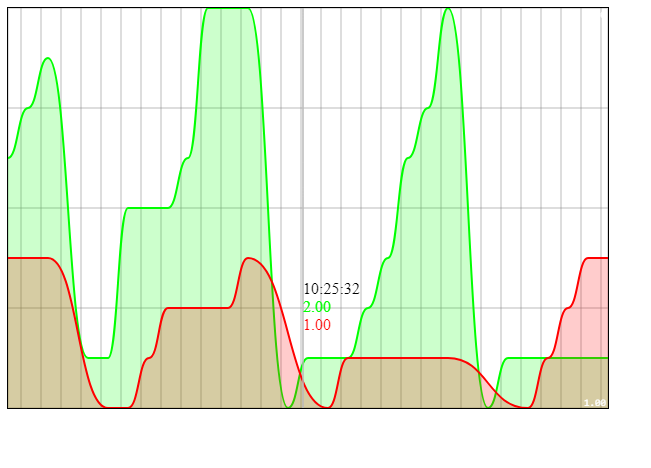

# kafka-streams

### Basic Kafka Operations

### Consumer
- It consumes data when it's available in the broker, depending on the model used in the topic (push or pull).

### Producer
- It produces data to the broker, creating an event in the broker.

### Broker
- It acts as an intermediary between the producer and the consumer, storing the data produced by the producer and making it available to the consumer.

### Supplier Interface
- It supplies data to the broker at regular intervals.

### Function Interface
- It waits for an event on the broker it listens to, processes the event, and sends it to the broker specified as an output.

### Rest Controller
- It acts like a supplier of data, supplying data to the broker when a request is made to the endpoint.

### start a zookeeper server
- after downloading kafka, navigate to the kafka directory and run the following command to start a zookeeper server
```start bin\windows\zookeeper-server-start.bat config/zookeeper.properties```

### start a kafka server
- run the following command to start a kafka server
```start bin\windows\kafka-server-start.bat config/server.properties```
- Note that the start command is just to open a new terminal window, and it's not part of the command.

### create a topic
- run the following command to create a topic
```bin\windows\kafka-topics.bat --create --topic R1 --bootstrap-server localhost:9092```

### list all topics
- run the following command to list all topics
```bin\windows\kafka-topics.bat --list --bootstrap-server localhost:9092```

### start a producer
- run the following command to start a producer
```start bin\windows\kafka-console-producer.bat --broker-list localhost:9092 --topic R1```

### start a consumer
- run the following command to start a consumer
```start bin\windows\kafka-console-consumer.bat --bootstrap-server localhost:9092 --topic R1 --from-beginning```

- Note that if we create a producer or a consumer on a topic that doesn't exist, the topic will be created automatically.

## Process a stream of events

- start bin\windows\kafka-console-consumer.bat --bootstrap-server localhost:9092 --topic R4 ^ 
--property print.key=true --property print.value=true ^
--property key.deserializer=org.apache.kafka.common.serialization.StringDeserializer ^
--property value.deserializer=org.apache.kafka.common.serialization.LongDeserializer
  
  
## Work with Kafka on Docker
- First run `docker run -d -p 9092:9092 --name broker apache/kafka:latest` to start a kafka broker on docker
- Then run `docker exec -it broker ./bin/sh` to access the broker
- Navigate to the directory where the script is located: `cd /opt/kafka/bin`
- Create a producer: `./kafka-console-producer.sh --bootstrap-server localhost:9092 --topic test-topic`
- Create a consumer: `./kafka-console-consumer.sh --bootstrap-server localhost:9092 --topic test-topic --from-beginning`

### Process a stream of events on docker
- docker run -d -p 9092:9092 --name broker apache/kafka:latest
- ./kafka-console-producer.sh --bootstrap-server localhost:9092 --topic test-topic
- ./kafka-console-consumer.sh --bootstrap-server localhost:9092 --topic test-topic --from-beginning
- ./kafka-console-consumer.sh --bootstrap-server localhost:9092 --topic R4 --from-beginning --formatter kafka.tools.DefaultMessageFormatter --property print.key=true --property print.value=true --property key.deserializer=org.apache.kafka.common.serialization.StringDeserializer --property value.deserializer=org.apache.kafka.common.serialization.LongDeserializer
- docker rm -f broker

## Some visualizations

